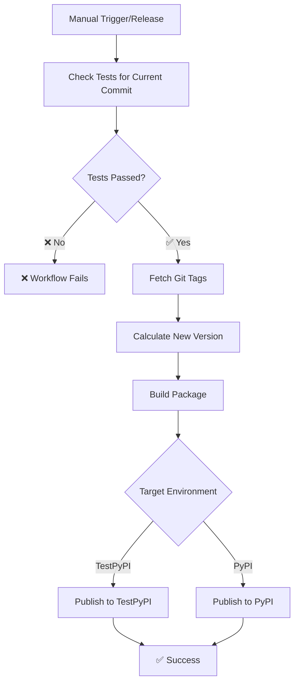

# Deployment & Publishing Guide

This document describes the automated deployment and publishing workflows for the VCS Metrics package.

## 📋 Table of Contents
- [Overview](#overview)
- [Python Package Publishing](#python-package-publishing)
- [Documentation Deployment](#documentation-deployment)
- [Version Control System](#version-control-system)
- [Environments](#environments)
- [Troubleshooting](#troubleshooting)

---

## 🎯 Overview

The VCS Metrics project uses **industry-standard CI/CD pipelines** that handle:

- ✅ **Continuous testing** on every commit/PR
- ✅ **Controlled releases** via GitHub Releases
- ✅ **Semantic versioning** via commit messages and tags
- ✅ **Automated publishing** to TestPyPI/PyPI
- ✅ **Documentation deployment** to GitHub Pages
- ✅ **Zero manual version management**

## 🏗️ Workflow Architecture

```
┌─────────────┐    ┌──────────────┐    ┌─────────────────┐
│   PR/Push   │───▶│ Test Workflow │───▶│ ✅ Fast Feedback │
│   to main   │    │ (test.yml)    │    │   (~2-3 min)    │
└─────────────┘    └──────────────┘    └─────────────────┘

┌─────────────┐    ┌──────────────┐    ┌─────────────────┐
│ GitHub      │───▶│ Publish      │───▶│ 📦 TestPyPI     │
│ Release     │    │ Workflow     │    │ 🚀 Production   │
└─────────────┘    │ (publish.yml)│    └─────────────────┘
                   └──────────────┘
```

---

## 📦 Python Package Publishing

### Workflow Triggers
The publishing workflow runs on:
- **Manual Dispatch** → Choose TestPyPI or PyPI (Primary method)
- **GitHub Releases** → Publishes to TestPyPI (Optional)
- **Version Tags** (v*.*.*) → Publishes to TestPyPI (Optional)

**🔒 Safety Requirement**: All publishing workflows **require tests to pass first** before proceeding.

### Automated Process
1. **Test Verification**: Checks that tests pass for the current commit
2. **Version Calculation**: Uses git tags + semantic versioning
3. **Package Building**: Creates wheel and source distributions
4. **Publishing**: Uses OpenID Connect (Trusted Publishing) for secure deployment

### 🔒 Workflow Dependencies & Safety

Our publishing workflow implements a **mandatory testing requirement** to prevent publishing broken packages:

#### **Workflow Structure**
```
check-tests → build → publish
```

#### **How It Works**

**For Manual Publishing:**
1. **check-tests job**: 
   - Finds test runs for the current commit SHA
   - If tests are still running, waits up to 10 minutes for completion
   - Only proceeds if tests pass for the **current commit**
   - ❌ Fails if tests fail or timeout

2. **build job**: 
   - Only runs if `check-tests` succeeds
   - Creates package artifacts

3. **publish job**: 
   - Only runs if both `check-tests` AND `build` succeed
   - Publishes to selected environment

**For Releases/Tags:**
- Assumes tests passed (since releases typically come from tested main branch)
- Still follows the same dependency chain

### Publishing Flow


#### **Common Scenarios**

**Scenario 1: Standard Workflow**
```bash
1. git commit -m "fix bug"              # Tests start automatically
2. Go to Actions → "Build and Publish" # Manual trigger
3. Select "testpypi"                    # Choose environment
4. Click "Run workflow"                 # Publish waits for tests
5. ✅ Tests pass → Package published    # Success
```

**Scenario 2: Tests Still Running**
```bash
1. git commit -m "add feature"          # Tests start automatically  
2. Immediately trigger publish          # Manual trigger (tests running)
3. Workflow waits up to 10 minutes      # Polls test status
4. ✅ Tests finish successfully         # Waits for completion
5. Package published                    # Proceeds safely
```

**Scenario 3: Tests Fail**
```bash
1. git commit -m "broken code"          # Tests start automatically
2. Trigger publish manually             # Manual trigger
3. ❌ Tests fail                        # Test verification detects failure
4. Workflow stops immediately           # No package built/published
5. Fix code and retry                   # Safe - no broken package released
```

---

## 🔢 Version Control System

### Semantic Versioning
We use [Semantic Versioning](https://semver.org/) with **automated version bumps** based on commit messages:

| Commit Message Format | Version Bump | Example |
|----------------------|--------------|---------|
| `minor: description` | Minor (new features) | `1.0.4 → 1.1.0` |
| `major: description` | Major (breaking changes) | `1.0.4 → 2.0.0` |
| `anything else` | Patch (default) | `1.0.4 → 1.0.5` |

### Examples
```bash
# Bug fix (defaults to patch)
git commit -m "fix calculation error in NAS metric"

# New feature  
git commit -m "minor: add support for custom similarity thresholds"

# Breaking change
git commit -m "major: redesign API for better performance"

# All these are patch bumps (default behavior)
git commit -m "update documentation"
git commit -m "improve code formatting"  
git commit -m "fix typo in README"
```

### Technical Implementation
- **Git Tags**: Store version history (`v1.0.5`, `v1.1.0`, etc.)
- **setuptools-scm**: Generates package version from git tags
- **tag_version.py**: Parses commit messages and creates appropriate tags
- **No version conflicts**: Dynamic versioning eliminates local/remote sync issues

---

## 🌍 Environments

### TestPyPI (Staging)
- **URL**: https://test.pypi.org/project/vcs-metrics/
- **Purpose**: Automated testing of package releases
- **Trigger**: GitHub releases and version tags
- **Authentication**: Trusted Publishing (OIDC)

### PyPI (Production)
- **URL**: https://pypi.org/project/vcs-metrics/
- **Purpose**: Production package distribution
- **Trigger**: Manual workflow dispatch or tag-based release
- **Authentication**: Trusted Publishing (OIDC)

### GitHub Pages (Documentation)
- **URL**: https://multimodal-intelligence-lab.github.io/Video-Comprehension-Score/
- **Purpose**: Public documentation hosting
- **Trigger**: Push to `main` branch (docs changes)
- **Content**: Sphinx-generated API docs and user guides

---

## 🔧 Developer Workflow

### For Contributors
1. **Clone repository**
   ```bash
   git clone https://github.com/hdubey-debug/vcs.git
   cd vcs
   ```

2. **Create feature branch**
   ```bash
   git checkout -b feature/new-metric
   ```

3. **Make changes** to `src/vcs/` directory

4. **Commit with semantic message**
   ```bash
   git commit -m "minor: add new similarity metric"
   ```

5. **Push and create PR**
   ```bash
   git push origin feature/new-metric
   # Create PR via GitHub UI
   ```

6. **After PR merge**: Tests run automatically (no publishing)

### For Maintainers

#### **Creating Releases**

##### **Manual Publishing** (Primary Method)
The recommended approach for publishing packages:

**Step 1: TestPyPI (Testing)**
1. **Ensure your latest commit has tests**: Check that tests are running/passed
2. Go to **Actions** → **"Build and Publish"**
3. Click **"Run workflow"**
4. Select **"testpypi"** from dropdown
5. Click **"Run workflow"**
6. **Workflow waits for tests**: If tests are still running, workflow waits up to 10 minutes
7. **Package published**: Only if tests pass for your current commit
8. **Verify the package** works on TestPyPI

**Step 2: PyPI (Production)**
1. After testing on TestPyPI, go back to **Actions** → **"Build and Publish"**
2. Click **"Run workflow"**
3. Select **"pypi"** from dropdown
4. Click **"Run workflow"**
5. **Tests verified again**: Same safety check for current commit
6. **Package is live** on production PyPI

**🔒 Safety Notes:**
- Workflow **automatically waits** for running tests to complete
- Publishing **fails immediately** if tests fail
- **No broken packages** can be accidentally published

##### **Alternative: GitHub Release Method** (Optional)
If you prefer automated releases:
1. **Create GitHub Release**:
   ```bash
   # Via GitHub UI: Go to Releases → "Create a new release"
   # Tag: v1.2.0, Title: "Release v1.2.0"
   # Click "Publish release"
   ```
2. **Result**: Automatically publishes to TestPyPI only

##### **Alternative: Tag-Based Release** (Optional)
```bash
# Create and push version tag
git tag -a v1.2.0 -m "Release v1.2.0"
git push origin v1.2.0
# → Automatic TestPyPI publishing
```

---

## 🏗️ Infrastructure

### GitHub Actions Workflows
- **`.github/workflows/test.yml`** ("Tests"): Continuous testing (every PR/push)
- **`.github/workflows/publish.yml`** ("Build and Publish"): Manual publishing to TestPyPI/PyPI
- **`.github/workflows/deploy-docs.yml`**: Documentation deployment to GitHub Pages

### Security
- **Trusted Publishing**: No API keys stored in repository
- **OpenID Connect**: Secure, short-lived tokens
- **Principle of least privilege**: Minimal required permissions

### Monitoring
- **Workflow status**: Visible in GitHub Actions tab
- **Package status**: Check TestPyPI/PyPI for successful uploads
- **Documentation**: Verify GitHub Pages deployment

---

## 🐛 Troubleshooting

### Common Issues

#### "Version already exists" Error
```bash
ERROR: HTTPError: 400 Bad Request from https://test.pypi.org/legacy/
```
**Cause**: Trying to publish an existing version  
**Solution**: Version bump will be handled automatically on next commit

#### "Permission denied" Error
```bash
ERROR: HTTPError: 403 Forbidden
```
**Cause**: Trusted Publishing not configured  
**Solution**: Set up Trusted Publisher on PyPI/TestPyPI

#### "No tags found" Error
```bash
fatal: No names found, cannot describe anything
```
**Cause**: No git tags in repository  
**Solution**: Automatic - system will create initial tag

#### "Tests failed" or "Tests timeout" Error
```bash
❌ Tests failed for commit abc1234 (conclusion: failure)
```
**Cause**: Current commit has failing tests  
**Solution**: Fix the failing tests and commit again

```bash
❌ Timeout waiting for tests to complete
```
**Cause**: Tests are taking longer than 10 minutes  
**Solution**: Check if tests are stuck, fix issues, or manually cancel and retry

#### "No test runs found" Error
```bash
⏳ No test runs found for commit abc1234 yet, waiting...
```
**Cause**: Tests haven't started yet for the current commit  
**Solution**: Wait a few minutes - this is normal for fresh commits

### Debug Commands
```bash
# Check current version that would be generated
python tag_version.py

# List all version tags
git tag -l v*.*.* | sort -V

# Check package build locally
python -m build

# Verify package contents
tar -tf dist/vcs_metrics-*.tar.gz
```

---

## 📚 Additional Resources

- [Semantic Versioning Specification](https://semver.org/)
- [PyPI Trusted Publishing Guide](https://docs.pypi.org/trusted-publishers/)
- [setuptools-scm Documentation](https://setuptools-scm.readthedocs.io/)
- [GitHub Actions Documentation](https://docs.github.com/en/actions)

---

## 🔄 Workflow Summary

### **Development Flow**
```
Developer PR → Tests run → Merge to main → Ready for release
```

### **Release Flow (Primary)**  
```
Commit → Tests start → Manual trigger → Wait for tests → Build → Publish
```

### **Detailed Flow**
```
1. git commit -m "change"        # Tests triggered automatically
2. Manual publish trigger        # Go to GitHub Actions  
3. Workflow waits for tests      # Up to 10 minutes
4. Tests pass → Build package    # Create artifacts
5. Publish to selected env       # TestPyPI or PyPI
```

### **Alternative Release Flow**
```
GitHub Release → Check tests → Build → Publish to TestPyPI only
```

This **industry-standard pipeline** ensures:
- ✅ **Fast feedback** during development
- ✅ **Controlled releases** when ready
- ✅ **Test-protected publishing** - no broken packages
- ✅ **Secure publishing** via Trusted Publishing
- ✅ **Zero manual version management**